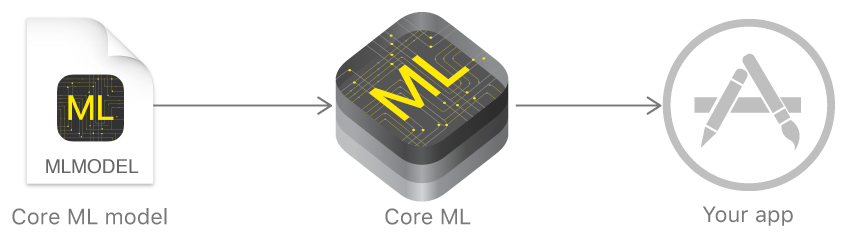
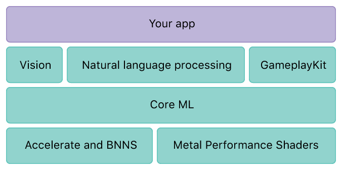

# iOS机器学习

1. [Core ML ](https://developer.apple.com/documentation/coreml)

With Core ML, you can integrate trained machine learning models into your app.

Core ML integrates a trained machine learning model into your app.
A trained model is the result of applying a machine learning algorithm to a set of training data. The model makes predictions based on new input data. For example, a model that's been trained on a region's historical house prices may be able to predict a house's price when given the number of bedrooms and bathrooms.
Core ML is the foundation for domain-specific frameworks and functionality. Core ML supports Vision for image analysis, Foundation for natural language processing (for example, the NSLinguisticTagger class), and GameplayKit for evaluating learned decision trees. Core ML itself builds on top of low-level primitives like Accelerate and BNNS, as well as Metal Performance Shaders.

